# Perform a white box and black box testing for the developed application, document the results

### Here I'm going to only do the white BOX testing for My Project :

* ## Test 1 (Working Locally and Deployed in the Back-end):

## First locally(Back-end) :
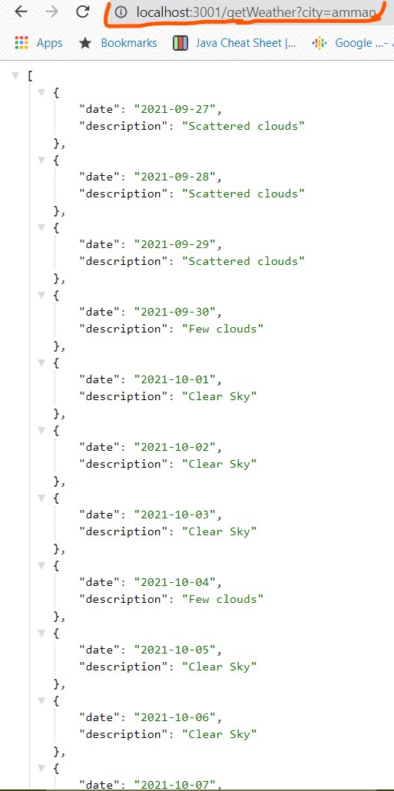


## Second Deployed(Back-end):
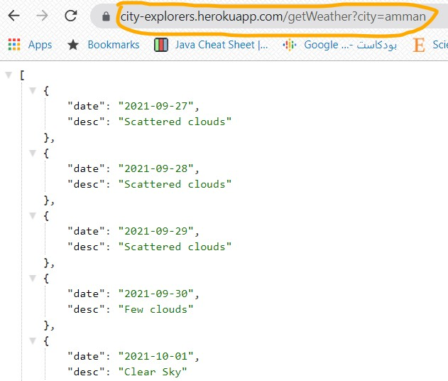
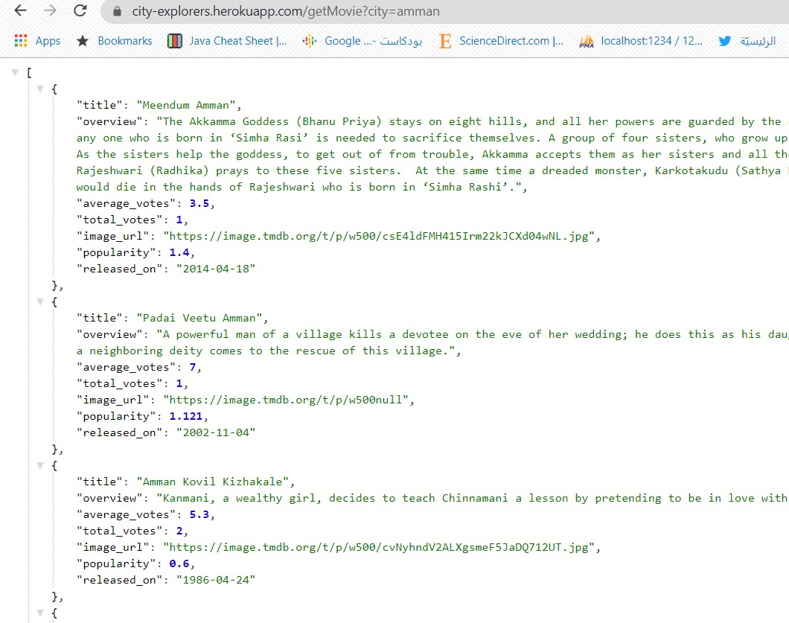
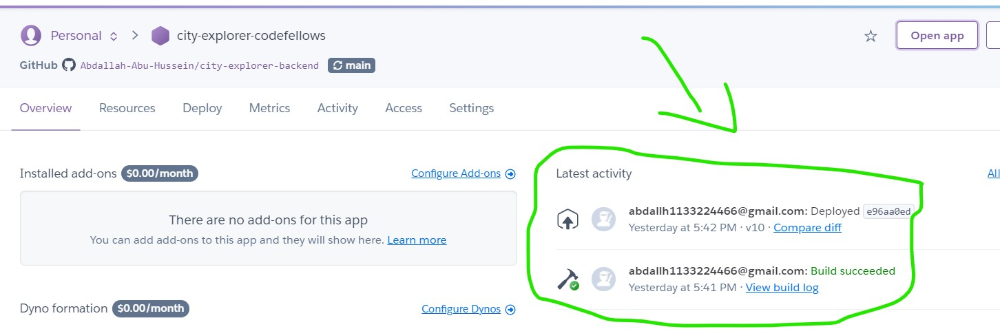

Note that the Data the same as the classes in the Back-end which is a test by itself :

```
class Forecast
{
  constructor(weatherForCity ){
    this.date = weatherForCity.valid_date;
    this.description = weatherForCity.weather.description;
  }
/////////////////////////
class Movie {
  constructor(movieForCity) {
    this.title = movieForCity.title;
    this.overview= movieForCity.overview;
    this.average_votes= movieForCity.vote_average;
    this.total_votes = movieForCity.vote_count;
    this.image_url = 'https://image.tmdb.org/t/p/w500' + movieForCity.poster_path;
    this.popularity = movieForCity.popularity;
    this.released_on = movieForCity.release_date;
  }
}

```


 * ## Test 2 (connecting to the front-end):

## First testing the button :-

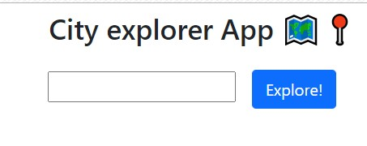

**Red line = Data from location_IQ**

**Green Line = Data From WeatherBit**

**yallow Line = Data from Themoviedb**

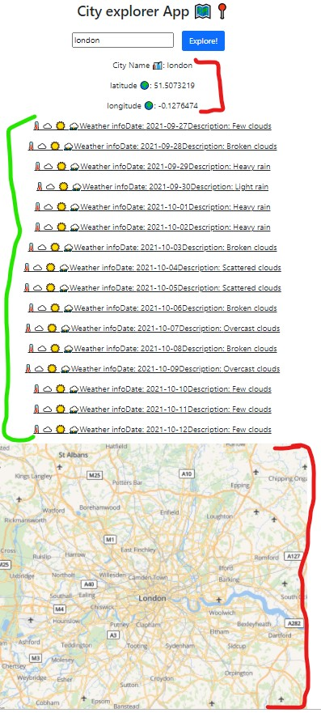
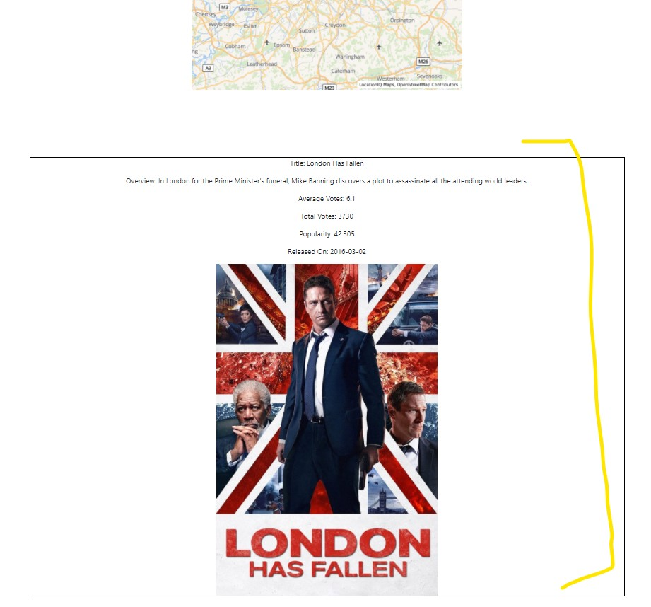
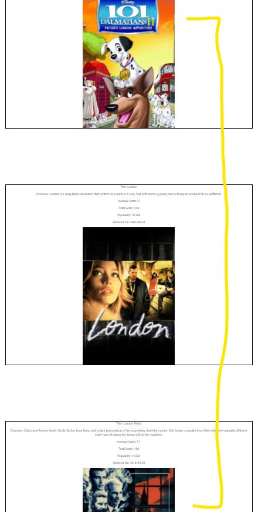

## Second Handling unexpected input :-

 we will see what will happen when add  unexpected input.

 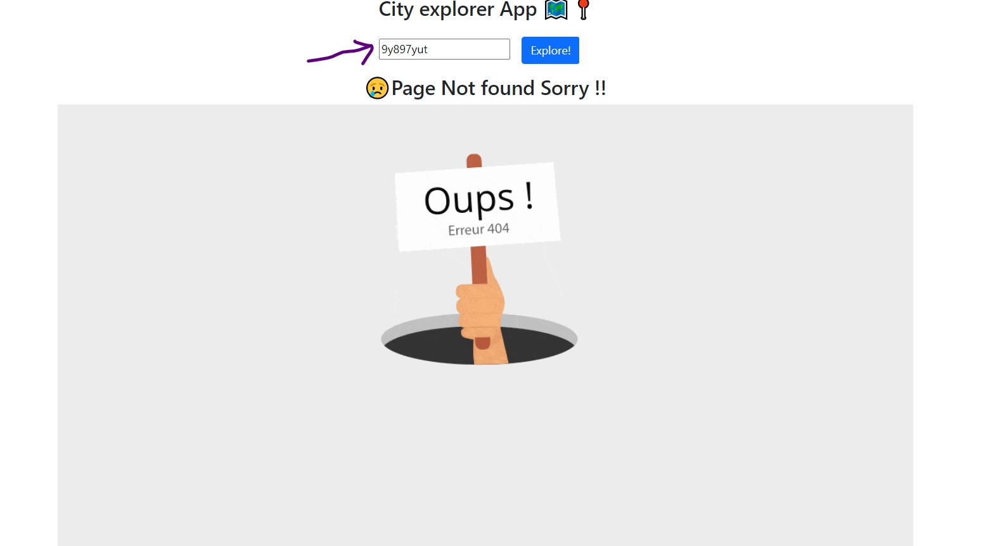

 And this is also apply on the Backend :-

 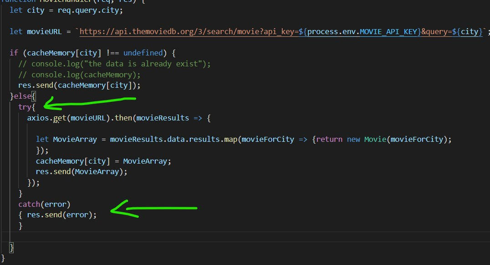

 the result : 

 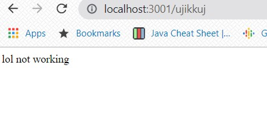

## Third Final deployment as full-stack:

 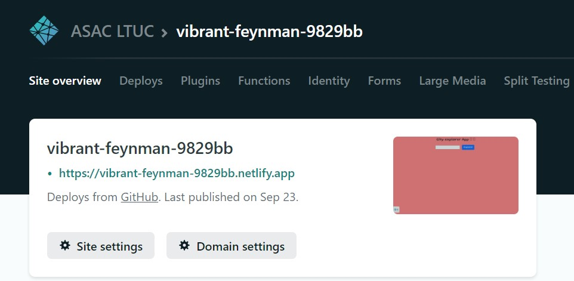
 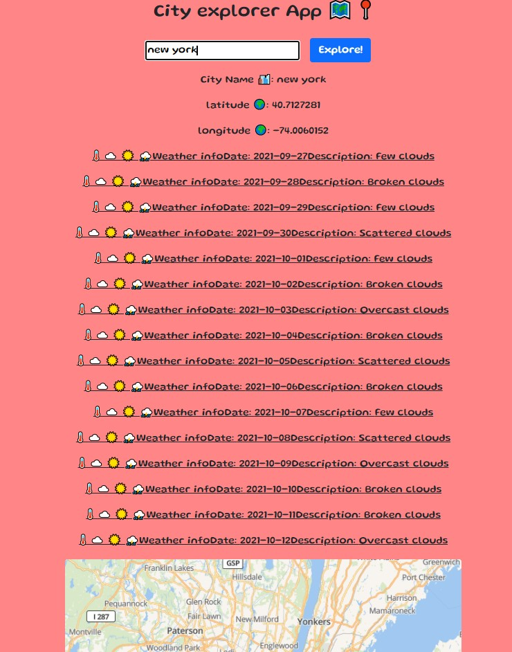
 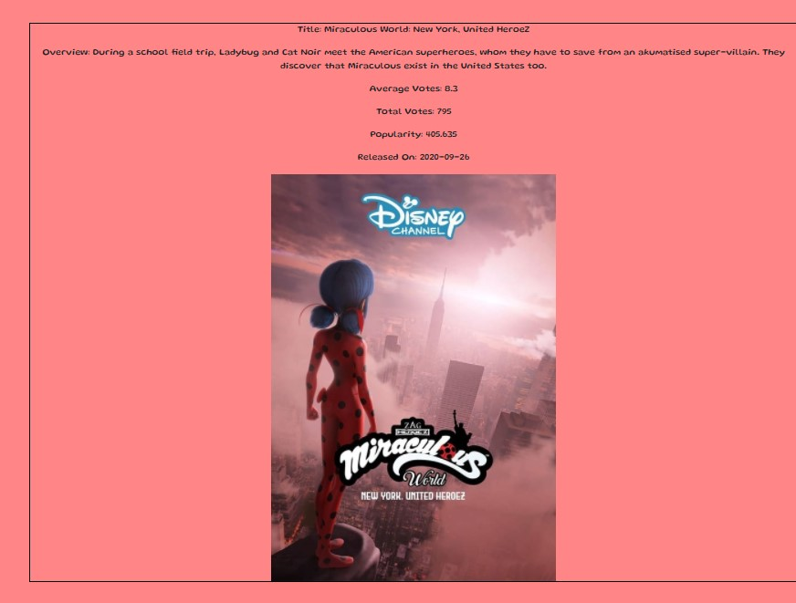
